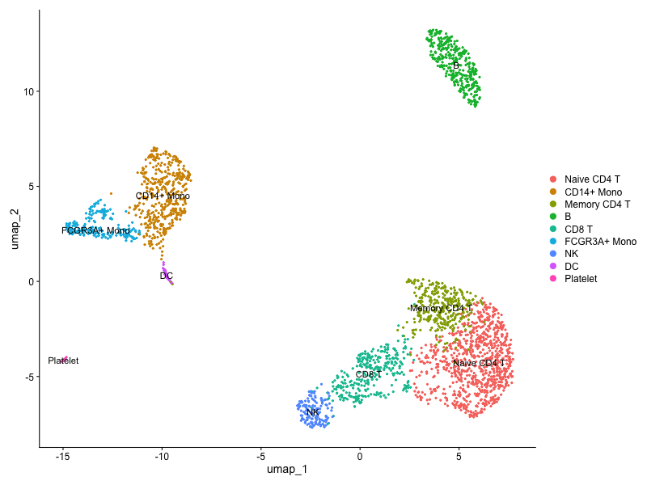
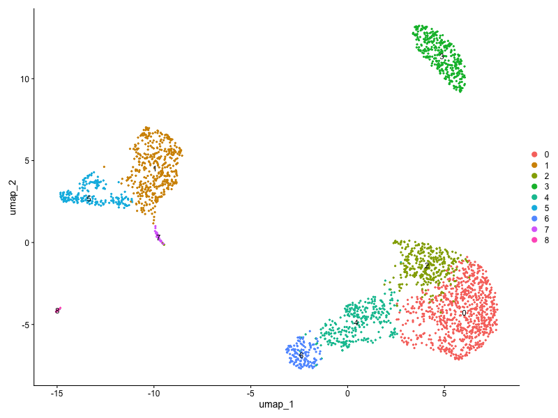
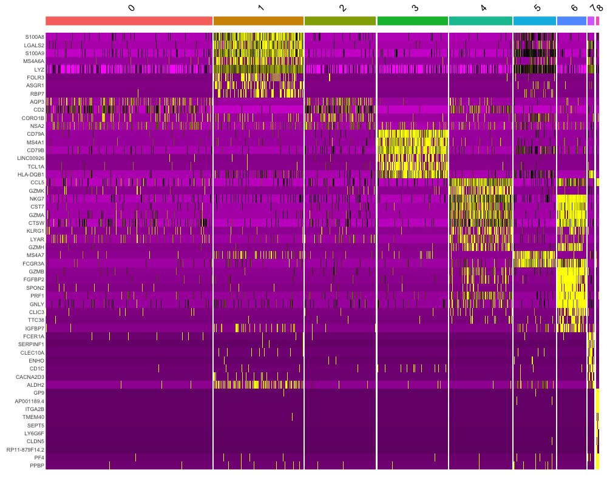
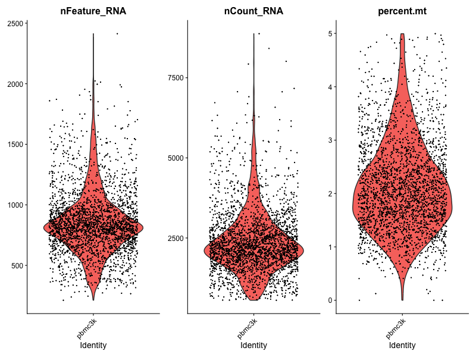
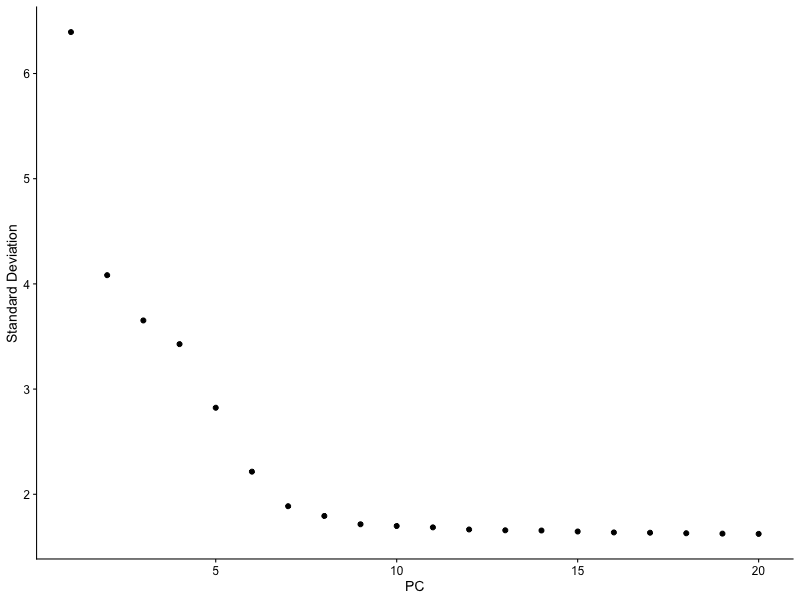

# scRNA-seq Analysis of PBMC 3k Dataset


End-to-end single-cell RNA-seq analysis of the 10X Genomics PBMC 3k dataset using Seurat v5.
Identifies and annotates 9 distinct immune cell populations from ~2,600 QC-filtered cells.

---

## Results

### UMAP — Annotated Cell Types


Nine immune populations identified with clear separation across the UMAP embedding,
including distinct monocyte subsets, T cell states, and innate immune populations.

### UMAP — Unsupervised Clusters


Graph-based clustering at resolution 0.5 yielded 9 clusters prior to manual annotation.

### Marker Gene Heatmap


Top differentially expressed marker genes per cluster identified using `FindAllMarkers()`
(Wilcoxon rank-sum test, min.pct = 0.25, logfc.threshold = 0.25).

### QC Metrics — Violin Plots


Cells filtered on: nFeature_RNA (200–2500), nCount_RNA, and mitochondrial gene percentage (< 5%).

### PCA Elbow Plot


First 10 principal components selected for downstream clustering and UMAP embedding
based on elbow plot inflection.

---

## Cell Type Annotations

| Cluster | Cell Type | Key Marker Genes |
|---------|-----------|-----------------|
| 0 | CD14+ Monocytes | CD14, LYZ, CST3 |
| 1 | Naive CD4+ T cells | IL7R, CCR7, TCF7 |
| 2 | CD8+ T cells | CD8A, GZMB, CCL5 |
| 3 | B cells | MS4A1, CD79A, CD79B |
| 4 | NK cells | NKG7, GNLY, PRF1 |
| 5 | FCGR3A+ Monocytes | FCGR3A, MS4A7, VMO1 |
| 6 | Memory CD4+ T cells | IL7R, S100A4, AQP3 |
| 7 | Dendritic Cells | FCER1A, CST3, HLA-DQA1 |
| 8 | Platelets | PPBP, PF4, GP1BB |

---

## Biological Interpretation

- **Monocyte heterogeneity** — CD14+ and FCGR3A+ monocytes form distinct clusters consistent
  with classical vs. non-classical monocyte subsets, reflecting known functional differences
  in inflammatory signalling and tissue patrolling.

- **T cell states** — Naive (CCR7+/IL7R+) and memory (S100A4+/IL7R+) CD4+ T cells
  cluster separately, capturing transcriptional differences in quiescence vs. antigen
  experience without requiring surface protein data.

- **NK cell signature** — NKG7 and GNLY co-expression in the NK cluster is consistent
  with cytotoxic granule content, distinguishing NK cells clearly from CD8+ T cells
  despite shared cytotoxic gene expression.

- **Rare populations** — Dendritic cells and platelets are recovered as small but
  transcriptionally distinct clusters, demonstrating sensitivity of the pipeline
  to low-frequency populations.

---

## Workflow

```
Raw 10X Data (filtered_feature_bc_matrix)
        │
        ▼
   QC Filtering
   (mito %, gene counts, UMI counts)
        │
        ▼
  Normalization (NormalizeData)
  Variable Feature Selection (FindVariableFeatures, nfeatures=2000)
        │
        ▼
  Scaling & PCA (ScaleData, RunPCA)
        │
        ▼
  Elbow Plot → 10 PCs selected
        │
        ▼
  Graph-based Clustering
  (FindNeighbors + FindClusters, resolution=0.5)
        │
        ▼
  UMAP Embedding (RunUMAP, dims=1:10)
        │
        ▼
  Marker Identification (FindAllMarkers)
  Manual Cell Type Annotation
        │
        ▼
  Differential Expression Analysis
```

---

## Key Stats

| Metric | Value |
|--------|-------|
| Starting cells | ~2,700 |
| Cells after QC | ~2,600 |
| Variable features | 2,000 |
| PCs used | 10 |
| Clusters | 9 |
| Cell types annotated | 9 |

---

## How to Reproduce

```r
# 1. Clone this repo
git clone https://github.com/solankidhvani/scRNAseq-PBMC-Seurat-analysis.git
cd scRNAseq-PBMC-Seurat-analysis

# 2. Download PBMC 3k data from 10X Genomics
# https://www.10xgenomics.com/datasets/3-k-pbm-cs-from-a-healthy-donor-1-standard-1-1-0
# Place filtered_feature_bc_matrix/ inside data/

# 3. Open pbmc_analysis.Rmd in RStudio and knit
# OR run from terminal:
Rscript -e "rmarkdown::render('pbmc_analysis.Rmd')"
```

**Environment:**
```
R >= 4.1
Seurat >= 5.0
ggplot2 >= 3.4
tidyverse >= 2.0
```

---

## Tools

| Tool | Purpose |
|------|---------|
| Seurat v5 | Core scRNA-seq analysis framework |
| ggplot2 | Visualization |
| tidyverse | Data manipulation |
| R Markdown | Reproducible reporting |

---

## Data Source

[10X Genomics PBMC 3k dataset](https://www.10xgenomics.com/datasets/3-k-pbm-cs-from-a-healthy-donor-1-standard-1-1-0)
— 2,700 peripheral blood mononuclear cells from a healthy donor sequenced on Illumina.

---

*Part of an active bioinformatics portfolio. See also:*
*[RNA-seq pipeline](https://github.com/solankidhvani/rnaseq-pipeline) |*
*[Variant calling pipeline](https://github.com/solankidhvani/variant-calling-pipeline) |*
*[Ontario Cancer Trends](https://github.com/GlennBlake/OntarioCancerTrends)*
